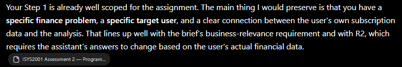
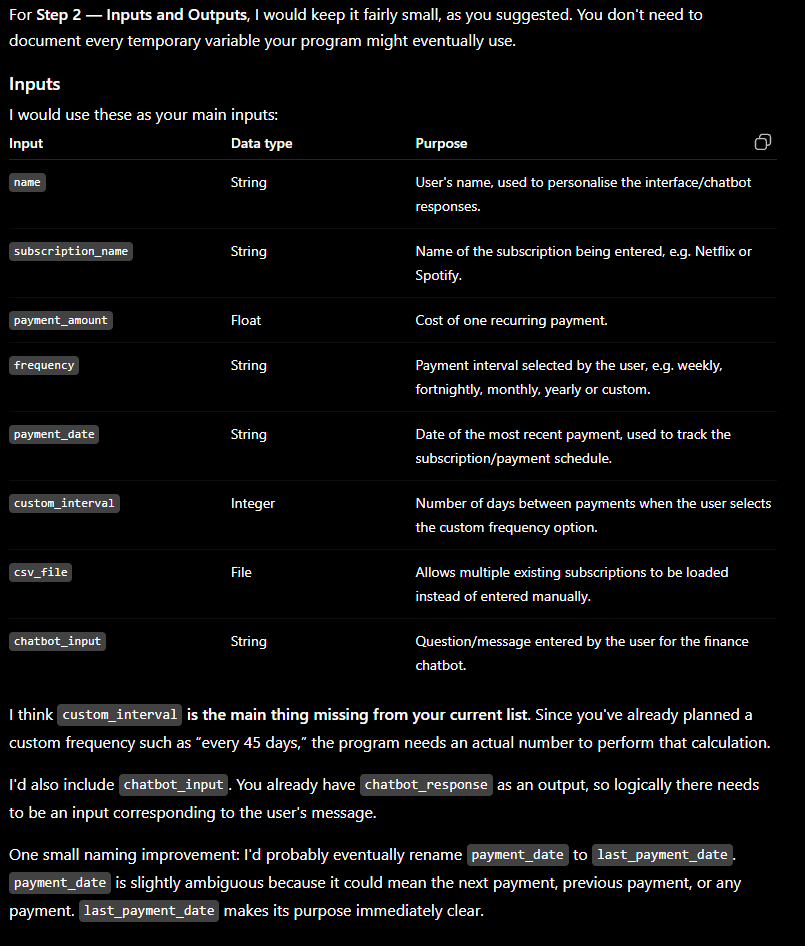
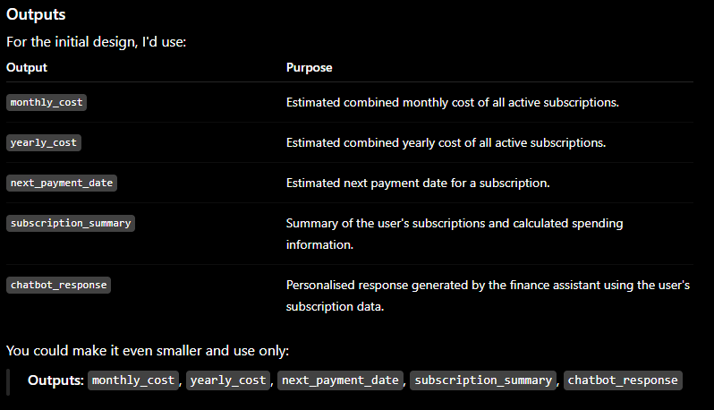
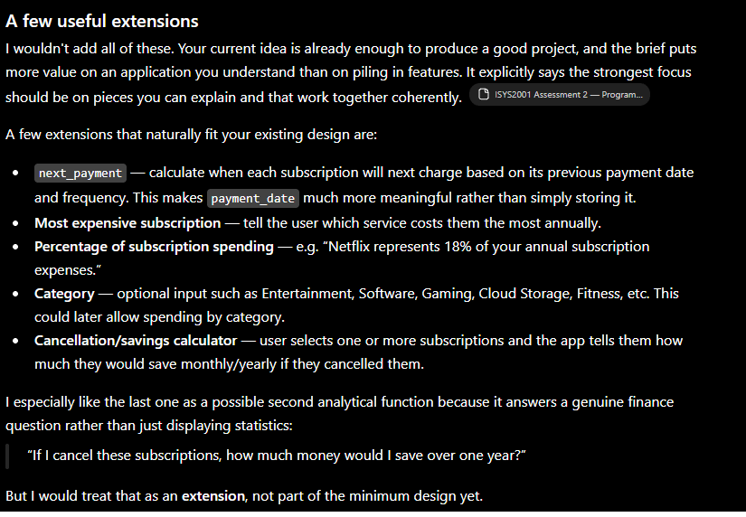

Week 7
---
### 11/09/26
The first day of this assignment was simply to setup the repo and make inital commits of all the files that will be used. This is so that in future days/weeks I do not have the hurdle of creating everything, giving me mentally an easy way to go in and work on the actual project.

### 13/09/26
Today I did the first step of the six step process, understand the problem. I chose the type of application I want to create aligned with a real world finance problem, gave an explanation of it, decided on some ground ideas, chose the target audience, and put forward my main goal in creating this.


Week 8
---
### 16/09/26
This time was doing step 2 and figuring out the inputs and outputs for my application, these are kept fairly general and are not concrete, and extra inputs and outputs may come once I start coding and think of new functions to add.

Today was also the start of using AI to assist in this project with 2 prompts. The first was not about the response, rather it was for building context since this will be an entire project where it will be assisting me not just a single prompt to fix a function or something. Here was my first prompt:

```
I have uploaded the brief to an assignment I have to do for intro to business programming. Read through it so we can work together on doing it. Do not worry about the developer diary since I will handle that as we go. So far I have made a github repo that contains the README.md, developer diary.md and finance_app.ipynb. Right now the finance app is not a google colab yet but it will be one, also I am willing to change the name later if suitable.

This is my step 1 and understanding of the problem: [Put in my Step 1 in the notebook]

Do not move onto step 2, simply read the brief and my step 1 of the six step method and understand what is being built.
```

I uploaded the brief to the prompt as well since it is vital context, the response given was simply this.


There was nothing for me to do with that response, and that was the point of it. But my second prompt was where work got done.

```
I need to figure out the inputs and outputs for this section, it is small and simple, we will just put down the name and data type of each input and name of each output we will have, for example here are some I have come up with.

Inputs: String name, File csv, float payment_amount, String subscription_name, String frequency, String payment_date

Outputs: yearly_cost, monthly_cost, chatbot_response

name will be useful for personalized outputs for the user but we will also need other stuff for actually doing tasks and giving info. These can be fairly general but must be important. If there is anything I am missing can you let me know of them and their purpose, also check through my project plan for any issues with it for my plan or additional extension/function ideas you have.
```

The first important part of the response was
 

With this part of the response for the inputs and outputs I kept the new inputs and outputs as they were simply ones I had missed, the more important change I took from the AI was changing payment_date to last_payment_date. I decided to make that change now as it makes the point of that variable much clearer for what I want.

The second part of the response was this


This is moreso for the next parts but I did ask for extenions and other useful functions I could add. Personally I like the ideas of next_payment, percentage of subscription spending and cancellation/savings calculator, as they all provide good meaningful value without creeping on the point of other parts. Most expensive subscription seems less useful due to the percentage of subscription and would usually be something obvious and unavoidable, and for category I don't see it providing much value.