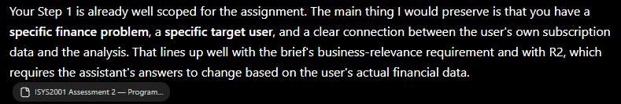
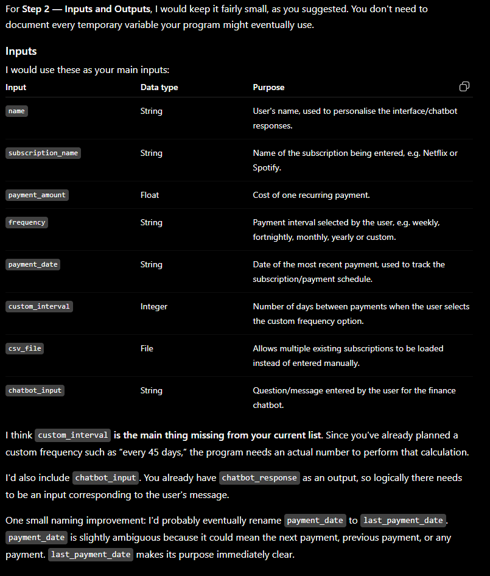
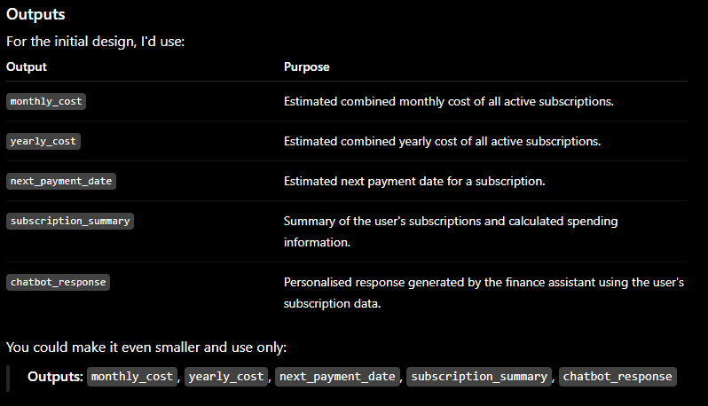
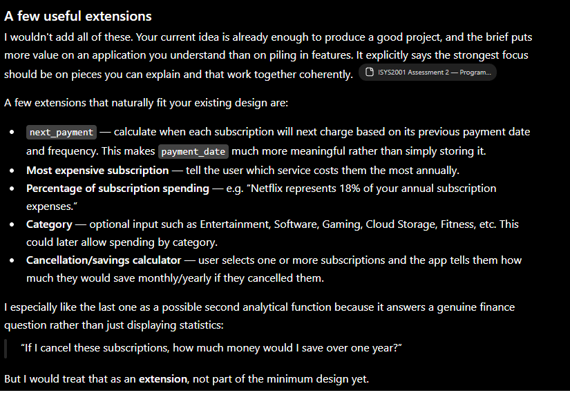
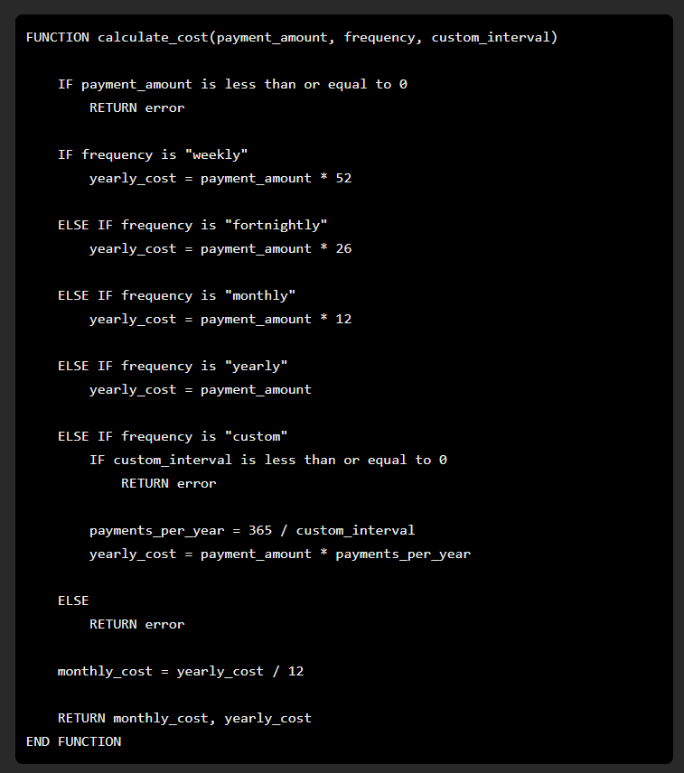
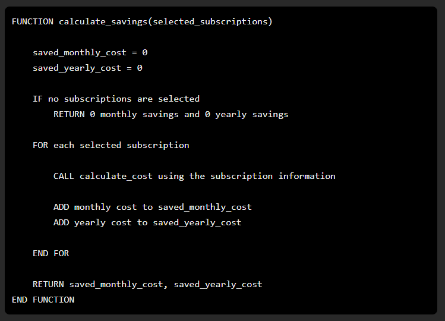

## Week 7
---
### 11/09/26
The first day of this assignment was simply to setup the repo and make inital commits of all the files that will be used. This is so that in future days/weeks I do not have the hurdle of creating everything, giving me mentally an easy way to go in and work on the actual project.

### 13/09/26
Today I did the first step of the six step process, understand the problem. I chose the type of application I want to create aligned with a real world finance problem, gave an explanation of it, decided on some ground ideas, chose the target audience, and put forward my main goal in creating this.


## Week 8
---
### 16/09/26
This time was doing step 2 and figuring out the inputs and outputs for my application, these are kept fairly general and are not concrete, and extra inputs and outputs may come once I start coding and think of new functions to add.

Today was also the start of using AI to assist in this project with 2 prompts. The first was not about the response, rather it was for building context since this will be an entire project where it will be assisting me not just a single prompt to fix a function or something. Here was my first prompt:

```
I have uploaded the brief to an assignment I have to do for intro to business programming. Read through it so we can work together on doing it. Do not worry about the developer diary since I will handle that as we go. So far I have made a github repo that contains the README.md, developer diary.md and finance_app.ipynb. Right now the finance app is not a google colab yet but it will be one, also I am willing to change the name later if suitable.

This is my step 1 and understanding of the problem: [Put in my Step 1 in the notebook]

Do not move onto step 2, simply read the brief and my step 1 of the six step method and understand what is being built.
```

I uploaded the brief to the prompt as well since it is vital context, the response given was simply this.


There was nothing for me to do with that response, and that was the point of it. But my second prompt was where work got done.

```
I need to figure out the inputs and outputs for this section, it is small and simple, we will just put down the name and data type of each input and name of each output we will have, for example here are some I have come up with.

Inputs: String name, File csv, float payment_amount, String subscription_name, String frequency, String payment_date

Outputs: yearly_cost, monthly_cost, chatbot_response

name will be useful for personalized outputs for the user but we will also need other stuff for actually doing tasks and giving info. These can be fairly general but must be important. If there is anything I am missing can you let me know of them and their purpose, also check through my project plan for any issues with it for my plan or additional extension/function ideas you have.
```

The first important part of the response was
 

With this part of the response for the inputs and outputs I kept the new inputs and outputs as they were simply ones I had missed, the more important change I took from the AI was changing payment_date to last_payment_date. I decided to make that change now as it makes the point of that variable much clearer for what I want.

The second part of the response was this


This is moreso for the next parts but I did ask for extenions and other useful functions I could add. Personally I like the ideas of next_payment, percentage of subscription spending and cancellation/savings calculator, as they all provide good meaningful value without creeping on the point of other parts. Most expensive subscription seems less useful due to the percentage of subscription and would usually be something obvious and unavoidable. And for category I have not come to a decision on it yet.

### 20/09/26
Step 3 worked problems was done this time. I chose 5 different ideas and went through the logic of them with calculations, when I begin writing the code this logic will be uuseful. And once I begin testing I will refer back to these worked examples to make sure the application lines up with my design. AI was not needed in creating this section however the examples will be fed to the AI so it can understand the logic design that is wanted.

## Week 9
---
### 23/09/26
Upon completing the week 9 workshop for building an interface step by step I got asked to jot down a few lines.
1. Although I am not up to the code section yet the equivalent to Transaction would be something like Subscription and FinanceTracker would be SubscriptionTracker.
2. SubscriptionTracker/FinanceTracker does not seem useful as it is pretty much just a class acting as a list. Subsciption/Transaction however is useful since it will be the main object of my project.

### 27/09/26
Step 4 pseudocode was worked on for today, rather than getting into the complexities with pandas on indivual lines, the chatbot and gradio interface I focused on the actual logic of functions that perform tasks as they are the ones in most need of design. I personally ran into an issue trying to format the pseudocode but I managed to remember code fences can still be used in text sections of .ipynb files allowing me to solve that.

Now for AI usage, I used it to help me plan out pseudocode for my functions giving a it a long prompt with details on what will be used for this project, my idea for the pseudocode and design of the project overall. Here is the prompt:
```
Before we get started I want to let you know what we are working with, it is mainly important for the actual python code since pseudocode is kept general, but it might still be useful to put it now. What I have learnt in this class so far for preparation for this project is basic if statements, loops, good formatted outputting, lists, functions, while loops, for loops, dictionaries, Pandas, APIs (mainly for the chatbot), reading csv file, and Gradio for a simple front end inside the colab/notebook file. These will be the main things we are sticking to for the code when we get to that.

Now lets get to work on the pseudocode, I think we should do pseudocode for each main function that performs a task. A normal main and menu will be replaced by Gradio and that seems out of scope for pseudocode. I believe the functions we should build in pseudocode are calculate_cost(), combined_cost(), next_payment(), load_csv(), cancellation/savings function, percentage of each subscription function that will probably be shown as a graph. We can leave the chatbot for later as I belive that is even unsuitable to make pseudocode for. Most functions will call calculate_cost as the fundemental reusable tool and alot of logic will revolve around it, use the worked examples as help for the logic where no matter the frequency of a subscription it will always first be converted to the yearly_cost.

The main idea is that there will be a gradio interface with different tabs, some for specific tasks like the front one will allow adding subscriptions, loading in a csv file, etc. Then another tab for example like analysis which may show a table/graph and some other stuff with costs. Basically everything will revolve around being part of tabs inside gradio where they are called from. We can always go back and make new pseudocode when needed.
```

This prompt will also be important context for later code. A couple screenshots from the output will be shown to understand the main idea as the entire response is quite long:





With this prompt I kept load_csv and spending_percentages the same as there is not much change possible for these functions anyway. calculate_savings and combined_cost went through minor wording changes just to better show what will happen rather than a sentence, I believe this makes the pseudocode easier to read. calculate_cost and next_payment went through a bigger change replacing the large if else chain with a case statement, this is more suitable to the problem and way more readable, python has way of using this when I begin making the code as well.